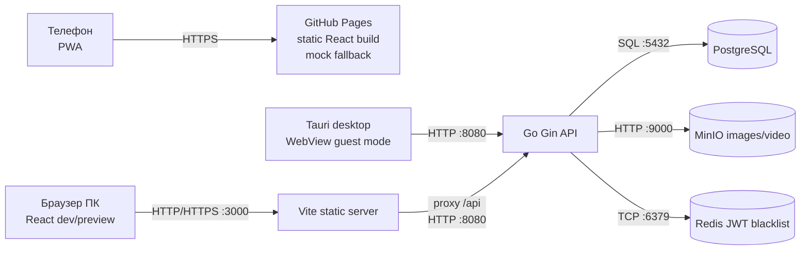
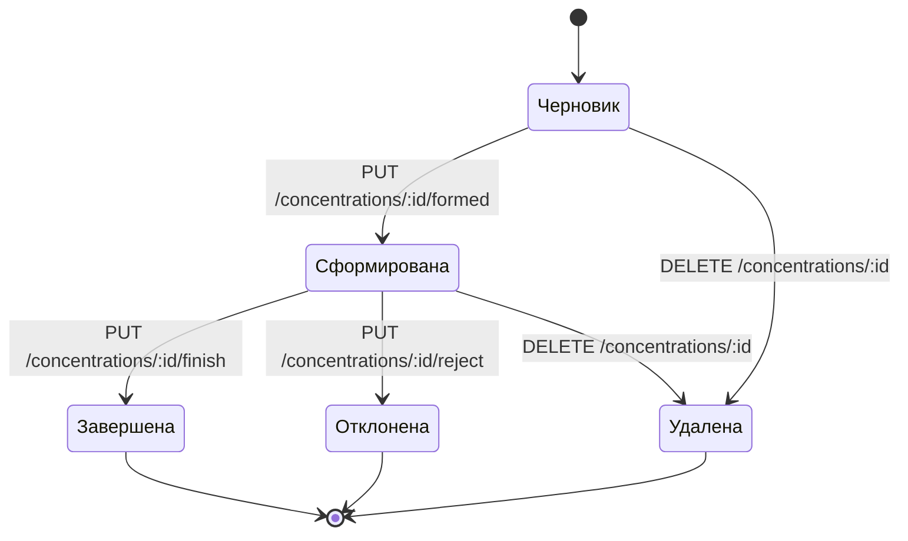
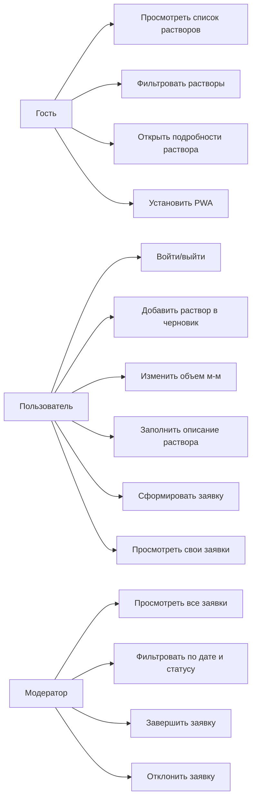

# Лабораторная 8: что показывать

## Redux-фильтр услуг

Фильтр услуг хранится в Redux Toolkit:

- `src/store/servicesSlice.ts`: поле `search`, action `setServicesSearch`.
- `src/pages/HomePage.tsx`: input берет начальное значение из Redux, поэтому после перехода на "Подробнее" и возврата строка поиска сохраняется.

## Адаптивность

Основные значения находятся в `src/style.css`:

- Desktop `>= 901px`: `.cards-grid { grid-template-columns: repeat(3, minmax(240px, 1fr)); }`.
- Tablet `561-900px`: 2 колонки карточек `repeat(2, minmax(220px, 1fr))`.
- Mobile `<= 560px`: 1 колонка карточек, формы и кнопки растягиваются в одну колонку.
- Таблица заявок получает горизонтальный скролл через `.requests-table { overflow-x: auto; }`.

Три адаптивные страницы: список растворов `/`, подробная страница `/electrolyte/:id`, страница заявки `/concentration/:id`.

## GitHub Pages и PWA

1. Скопировать `.env.pages.example` в `.env.pages`.
2. В `.env.pages` заменить `VITE_APP_BASE=/electrolyte-app/` на имя своего репозитория.
3. Собрать: `npm run build:pages`.
4. Если библиотека не установлена: `npm install -D gh-pages`.
5. Опубликовать: `npm run deploy`.

PWA-файлы:

- `public/manifest.webmanifest`
- `public/sw.js`
- регистрация service worker в `src/main.tsx`

На GitHub Pages приложение работает по HTTPS. API на Pages недоступен, поэтому список растворов падает на mock-данные.

## Tauri

Гостевой режим включается в `.env.tauri` через `VITE_GUEST_ONLY=true`.

Чтобы подключить собранный Tauri к Go API по локальной сети:

1. Узнать IP компьютера с бэкендом: `ipconfig`.
2. В `.env.tauri` указать `VITE_API_ORIGIN=http://<IP>:8080`.
3. Убедиться, что Go API запущен на `0.0.0.0:8080`, а firewall пропускает порт.
4. Установить Tauri, если еще не установлен: `npm install -D @tauri-apps/cli @tauri-apps/api`.
5. Проверить dev: `npm run tauri dev`.
6. Собрать native build: `npm run tauri build`.

Для Wireshark: фильтр `tcp.port == 8080`, открыть собранный Tauri, перейти на список растворов, выбрать пакет GET `/api/electrolytes`, посмотреть `Src Port`.

## Deployment Diagram

## State Diagram

## Use Case Diagram

